# Week 2

## Topics

<li> Software process models
<li> Process Activities
<li> Coping with change
<li> Process Improvement

## Software process models
A software process is a set of related activities that leads to the production of a software system.

**Four Funtamemtal Software Engineering Activity**
- Software Specification 
- Software Development
- Software Validation
- Software Evaluation (*Softfare must evolve to meet changing customer needs*)

**Software Process Models**  
Generic models are high-level, abstract descriptions of software processes that can be used to explain different approaches to software development

### Waterfall model
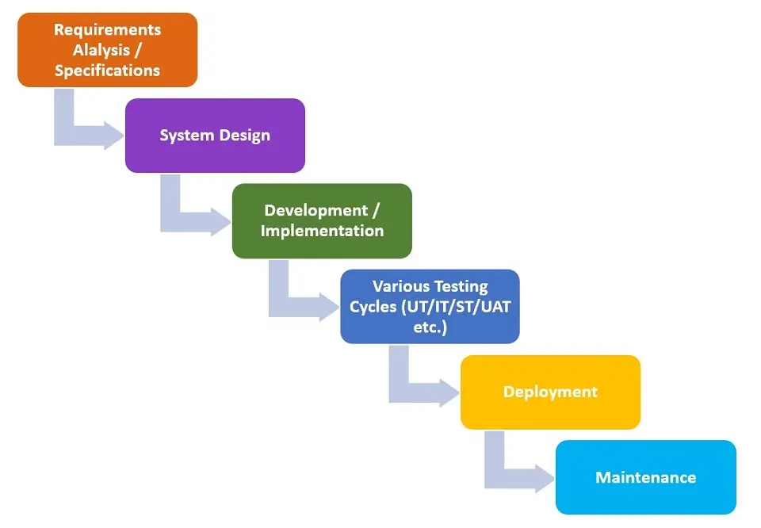
### Incremental Model
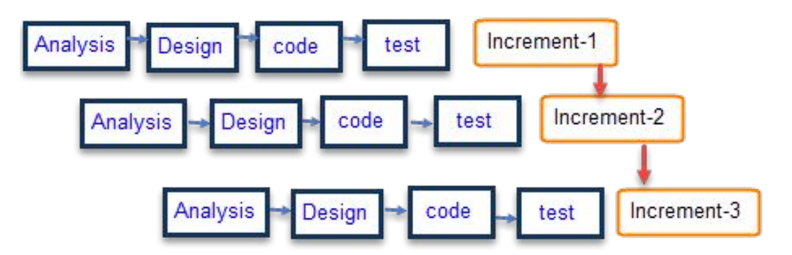
### Integration and Configuration Model
The integration and configuration process model is based on reuse. In this software process model, systems are adapted from existing components as much as possible. The reused components may be configured to adapt their behavior and functionality to the requirements of the new software or system.

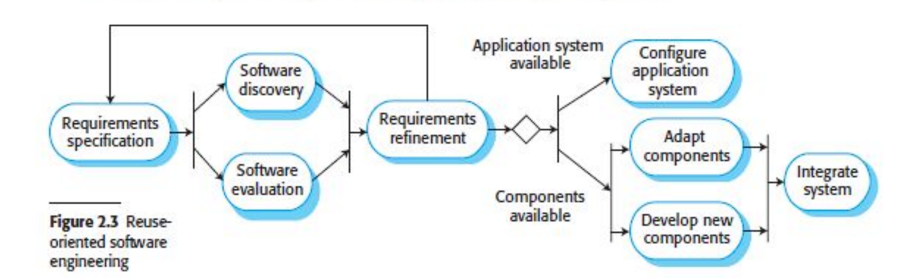

## Process Activities
- **Software Design and Implementation:** Software design is a creative activity in which you identify software components and their relationships, based on a customer's requirements. Implementation is the process of realizing the design as a program.
- **Software Validation:** checks that the software product satisfies or fits the intended use.
- **Software Evaluation:** The process of measuring the performance and utility of software assets in businesses' inventories. The purpose of software evaluation is to detect dysfunctional and unused software.

## Coping with change
It is a process of adapting to changes that occur during software development. These changes may relate to project requirements, technologies, architecture, business goals, and other factors that affect the software creation process.
## Process Improvement
Process Improvement means understanding existing processes and changing these processes to increase product quality and/or reduce costs and development time.

## Agile Software development
Это гибкий подход к разработке программного обеспечения, который фокусируется на быстрой адаптации к изменениям, взаимодействии с клиентами и регулярной доставке небольших, работающих частей продукта. Основные принципы Agile изложены в Манифесте гибкой разработки ПО (Agile Manifesto), опубликованном в 2001 году
### Основные характеристики Agile
- **Итеративная разработка:** Проект разбивается на короткие циклы (итерации или спринты), обычно продолжительностью от 1 до 4 недель. В конце каждой итерации команда представляет работающий продукт.
- **Постоянная обратная связь:** Постоянное взаимодействие с клиентом или пользователем для получения обратной связи и корректировки требований по ходу разработки.
- **Адаптивность к изменениям:** Agile приветствует изменения требований даже на поздних этапах проекта. Команда всегда готова пересматривать и корректировать план работы
- **Командная работа:** Agile основывается на тесном взаимодействии всех участников команды (разработчики, тестировщики, менеджеры и клиенты) и прозрачности процесса разработки.
- **Работающий продукт — главный показатель успеха:** В Agile основное внимание уделяется регулярной поставке работающего программного обеспечения, которое приносит реальную пользу клиенту.
### Основные методологии Agile
- **Scrum:** Одна из наиболее популярных методологий. Она организует процесс работы в короткие спринты, назначает роли (например, Product Owner, Scrum Master) и включает регулярные встречи (ежедневные стендапы, планирование спринтов, ретроспективы).
- **Kanban:** Методология, которая визуализирует задачи с помощью доски и карточек, помогая отслеживать рабочий процесс и улучшать его гибкость. Основной фокус на визуализации потока задач и устранении узких мест.
- **XP (Extreme Programming):** Методология, направленная на повышение качества разработки через тесное сотрудничество с клиентами, частые релизы, тестирование и парное программирование.
## Принципы Agile (Манифест Agile):
1. Люди и взаимодействие важнее процессов и инструментов.
2. Рабочий продукт важнее исчерпывающей документации.
1. Сотрудничество с клиентом важнее контрактных переговоров.
1. Готовность к изменениям важнее следования первоначальному плану.

Agile помогает командам быстро реагировать на изменения, предоставлять клиентам актуальные решения и работать более продуктивно в условиях изменяющихся требований.

# Week 3

## Topics

<li> Functional and non-functional requirements
<li> Requirements engineering processes
<li> Requirements elication, specification and validation
<li> Requirements change  

### Functional and non-functional requirements
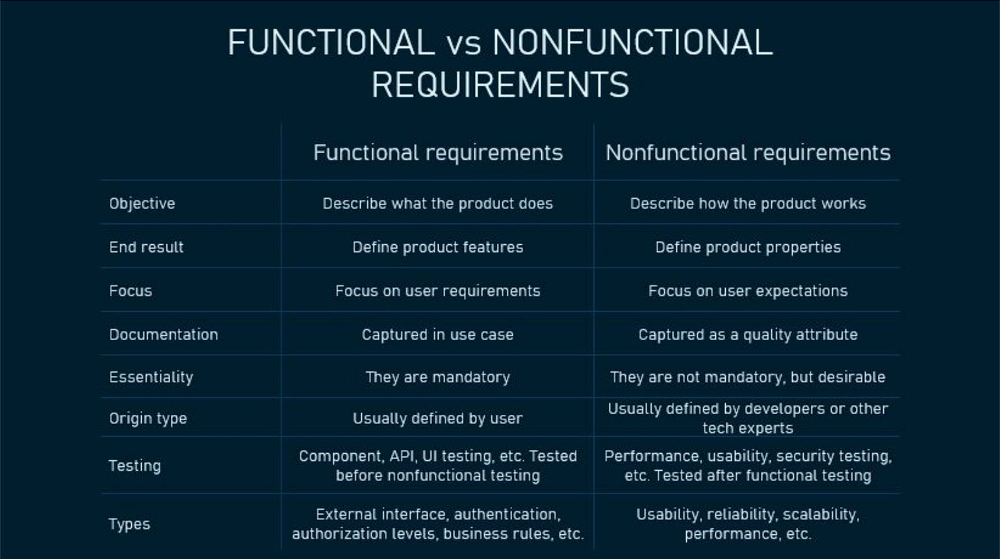

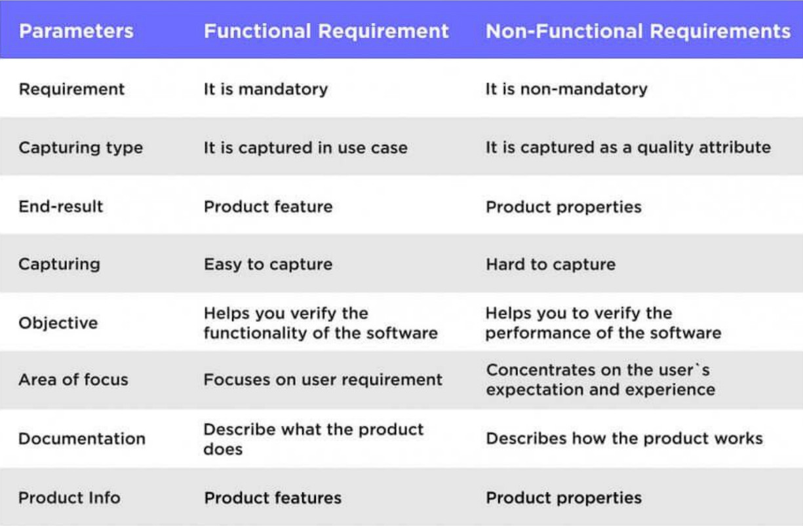

**Functional requirements** - what system should do  
**Non-Functional requirements** - how system should work

### Requirements engineering processes
Это процесс систематического определения, документирования и управления требованиями к программному обеспечению или системе. Процесс помогает разработчикам и заказчикам лучше понять цели системы, гарантировать их достижение и управлять изменениями требований на протяжении жизненного цикла проекта.

### Requirements elication, specification and validation
- **Elication (Сбор требований)** - это процесс выявления потребностей и ожиданий всех заинтересованных сторон, включая клиентов, пользователей, и команды разработки.
- **Specifation** - это процесс документирования требований, выявленных на этапе их сбора и анализа. Этот документ становится основой для разработки, тестирования и дальнейшей валидации требований.
- **Validation** - это процесс проверки и подтверждения того, что задокументированные требования правильно отражают потребности всех заинтересованных сторон и являются реализуемыми.
### Requirements change 
 это процесс внесения изменений в требования к системе в течение всего жизненного цикла разработки программного обеспечения. Поскольку требования могут изменяться из-за различных факторов, правильное управление изменениями является критически важным для успеха проекта.

 # Week 4

## Topics
- Context Models
- Interactional and Structural Models
- Behavioral Models
- Model-driven engineering

System modeling is the process of developing abstract models of a system, with each model presenting a different view or perspective of that system. Models are used during the requirements engineering process to help derive the detailed requirements for a system, during the design process to describe the system to engineers implementing the system, and after implementation to document the system`s structure and operation.
***UML (Unified Modelling language)* -> 14 diagram types
### Context Models
это графические или текстовые представления, которые описывают окружающую среду системы, ее взаимодействия с пользователями и другими системами, а также основные компоненты, которые влияют на ее функционирование. Контекстные модели помогают командам разработки понять, как система будет использоваться, кто ее будет использовать и какие факторы могут повлиять на ее поведение.

### Interactional Models
это представления, которые описывают, как пользователи взаимодействуют с системой, а также как различные компоненты системы взаимодействуют друг с другом. Эти модели помогают визуализировать, анализировать и проектировать взаимодействия, что важно для обеспечения удобства и эффективности пользовательского опыта.
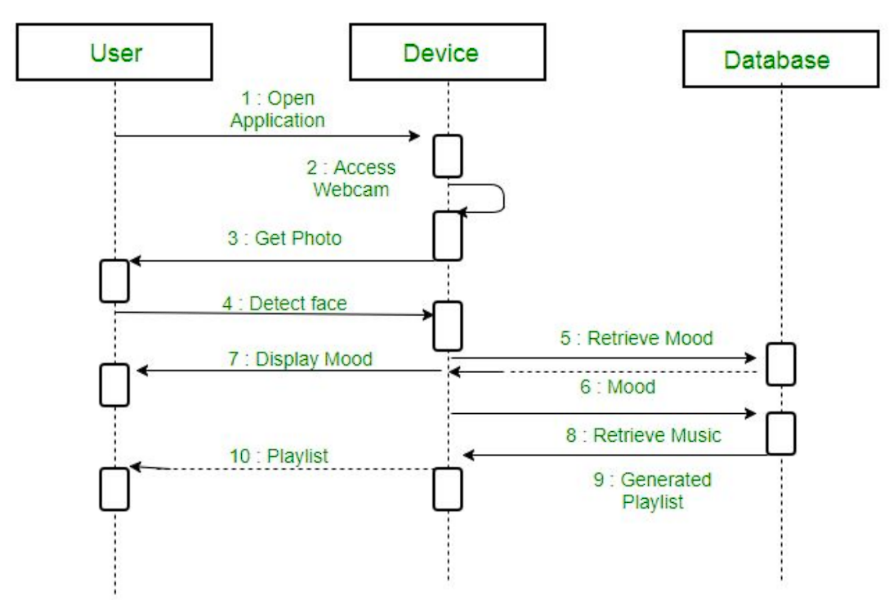
### Structural Models
 это представления, которые описывают организацию системы, ее компонентов и их взаимосвязи. Эти модели помогают визуализировать архитектуру системы, показывая, как различные элементы взаимодействуют и как они структурированы внутри системы. Структурные модели являются важным инструментом в инженерии требований и системном проектировании.
 
 ### Behavioral Models
 это представления, которые описывают динамическое поведение системы, ее компонентов и их взаимодействий с пользователями и другими системами. Эти модели помогают понять, как система будет реагировать на события, как она будет изменяться во времени и как различные компоненты будут взаимодействовать для выполнения функций.
 
 ### Model-driven engineering
  это подход в разработке программного обеспечения, который фокусируется на использовании моделей как основного артефакта на всех этапах процесса разработки. MDE позволяет создавать, анализировать и трансформировать модели для генерации кода и другой документации, что может значительно упростить и ускорить процесс разработки.

# Week 5

## Topics
- Architectural design decisions
- Architectural views
- Architectural patterns
- Application architectures

### Architectural design
Give answer to questions like, how a software system should be organized
and also designing the overall structure of that system.
### Architectural design decisions
это ключевые выборы и определения, принимаемые во время разработки архитектуры системы. Эти решения формируют основную структуру системы, определяют, как различные компоненты будут взаимодействовать, и задают параметры, влияющие на производительность, надежность и удобство использования.

## Architectural views
 это различные способы представления архитектуры системы, которые помогают различным заинтересованным сторонам (разработчикам, архитекторам, менеджерам, заказчикам) понять ее структуру и поведение. Каждый вид акцентирует внимание на определенных аспектах системы, обеспечивая более глубокое понимание и облегчая коммуникацию.

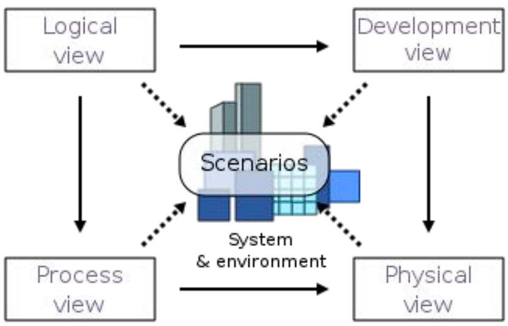
 ## Architectural patterns
 это общепринятые решения для часто возникающих проблем в архитектуре программных систем. Они предоставляют структурированные подходы к проектированию системы, описывая, как различные компоненты и их взаимодействия должны быть организованы. Архитектурные шаблоны помогают обеспечить лучшие практики, улучшить качество разработки и упростить поддержку системы.
 - **Архитектура на основе представления-управления (Model-View-Controller - MVC):** В этом шаблоне система разделена на три основные компоненты: модель (данные), представление (интерфейс пользователя) и контроллер (логика управления). Это разделение упрощает поддержку и тестирование.
 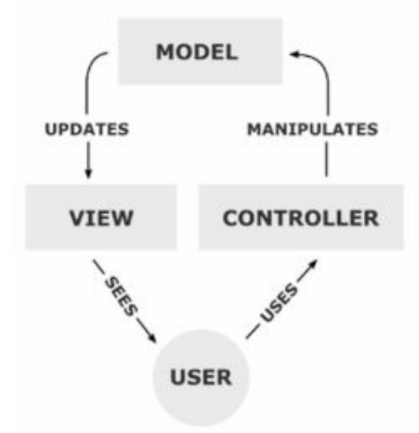
 - **Многослойная архитектура (Layered Architecture):** В этом шаблоне система организована в несколько слоев (например, презентационный, бизнес-логики и доступа к данным). Каждый слой имеет четко определенные обязанности и взаимодействует только с соседними слоями, что упрощает тестирование и поддержку.
 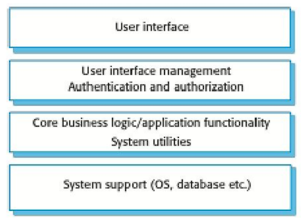

 - **Repository Architecture (Архитектура репозитория):** Это архитектурный шаблон, который используется для организации и управления данными в программных системах. Он разделяет бизнес-логика и доступ к данным, позволяя более удобное управление и манипуляцию с данными, а также упрощая тестирование и поддержку кода. 
 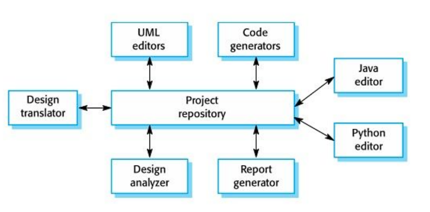

 - **Клиент-сервер (Client-Server):** Этот шаблон разделяет клиентские и серверные компоненты, позволяя клиентам запрашивать услуги у серверов. Он широко используется в веб-приложениях, где клиент (браузер) взаимодействует с сервером через API.
 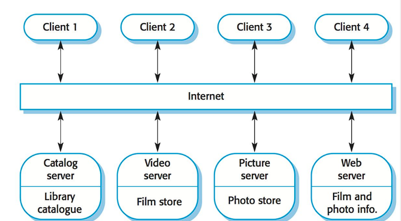

 ## Application Architectures (Архитектурные решения приложений)
 это структурные схемы, которые описывают, как различные компоненты приложения взаимодействуют друг с другом и с окружающей средой. Правильная архитектура приложения обеспечивает масштабируемость, гибкость и устойчивость системы, а также упрощает ее разработку, тестирование и поддержку.

 - **Transaction Processing Systems, Системы обработки транзакций** -  это информационные системы, которые управляют и обрабатывают данные о транзакциях. Они предназначены для эффективного и точного выполнения большого объема рутинных транзакций, обеспечивая, чтобы данные были захвачены и обработаны в реальном времени или вблизи реального времени.
 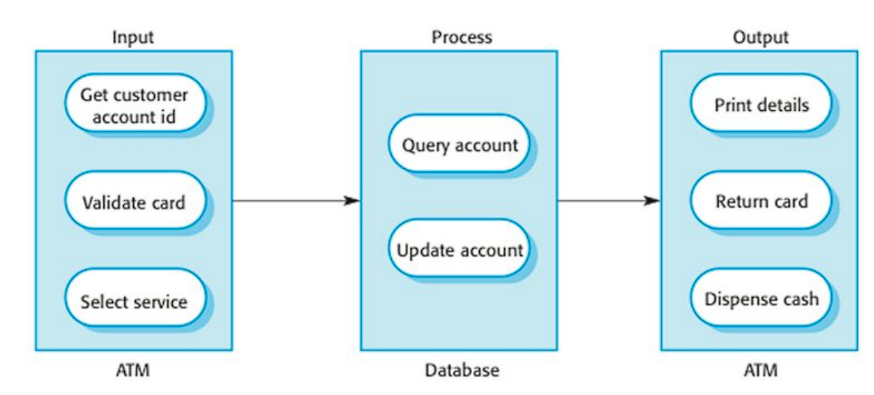
 - **Information Systems, Информационные системы** - представляют собой интегрированный набор компонентов для сбора, хранения, обработки и передачи данных и информации. Они используются для поддержки принятия решений, координации, контроля, анализа и визуализации в организации.
 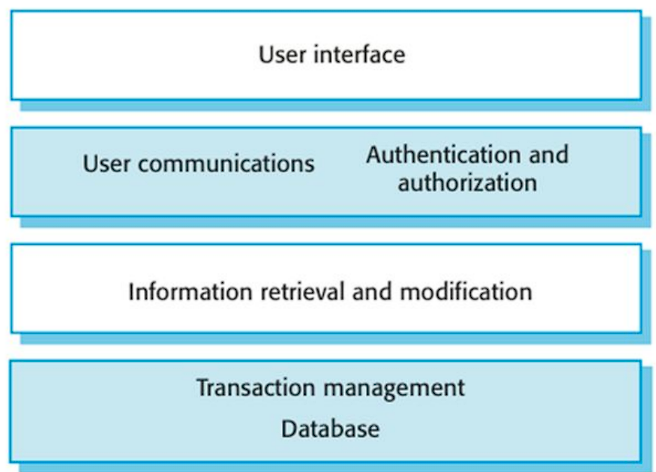
 - **Language Processing Systems, Системы обработки языка** - это программные приложения, которые анализируют, понимают и генерируют человеческий язык. Они часто являются частью области, известной как Обработка естественного языка (NLP), которая сочетает вычислительную лингвистику, машинное обучение и искусственный интеллект для упрощения взаимодействия между компьютерами и людьми с помощью естественного языка.
 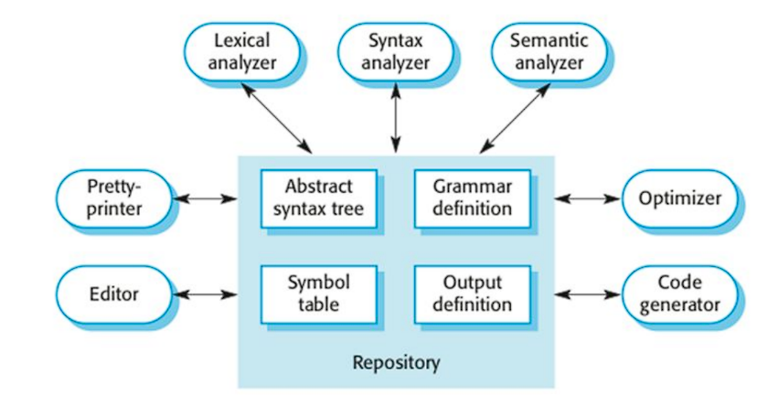

 # Week 6

## Topics
- Object oriented design using UML
- Design patterns
- Implementation issues
- Open source development

## Object oriented design using UML
это методология проектирования программных систем, основанная на принципах объектно-ориентированного программирования (ООП). UML предоставляет графические нотации для моделирования объектов и их взаимодействий, что помогает разработчикам четко визуализировать и организовывать структуру системы
### Основные концепции объектно-ориентированного дизайна
- **Объекты:** Основные строительные блоки ООП, которые содержат состояние (данные) и поведение (методы).
- **Классы:** Шаблоны для создания объектов, определяющие их атрибуты и методы.
- **Наследование:** Возможность создавать новые классы на основе существующих, заимствуя их атрибуты и методы.
- **Инкапсуляция:** Скрытие внутреннего состояния объекта и предоставление доступа к нему только через методы.
- **Полиморфизм:** Способность объектов разных классов реагировать на один и тот же метод по-разному.

### Design patterns
это повторно используемые решения распространенных проблем, возникающих при проектировании программного обеспечения. Они представляют собой лучшие практики, которые помогают разработчикам создавать гибкие, поддерживаемые и масштабируемые системы. Шаблоны проектирования не являются конкретным кодом, а представляют собой абстрактные идеи, которые можно адаптировать к конкретным ситуациям.

### Implementation issues
Важнейшим этапом этого процесса является, конечно же, внедрение системы,
на котором вы создаете исполняемую версию программного обеспечения
Внедрение может включать разработку программ на языках программирования высокого или низкого уровня или адаптацию типовых
готовых систем для удовлетворения конкретных требований
организации

- **Reuse**, С 1960-х по 1990-е годы большинство новых программ
разрабатывалось с нуля, путем написания всего кода на
языке программирования высокого уровня, Единственным значительным повторным использованием программного обеспечения было повторное использование
функций и объектов в библиотеках языков программирования
- **Configuration management**, При разработке программного обеспечения изменения происходят постоянно, поэтому
управление изменениями абсолютно необходимо, Когда в разработке
программной системы участвуют несколько человек, вы должны быть уверены, что
члены команды не мешают работе друг друга
- **Host-target development**, Большая часть профессиональных разработок программного обеспечения основана на
модели *"хост-цель"*, Программное обеспечение разрабатывается на одном компьютере (главном компьютере), но
запускается на отдельном компьютере (целевом компьютере), В более общем плане мы можем говорить о
платформе разработки (хосте) и платформе выполнения (цели).

### Open source development
это подход к разработке программного
обеспечения, при котором публикуется исходный код программной системы и
приглашаются добровольцы для участия в процессе разработки.

# Week 7

## Topics
- Development testing
- Test-driven development
- Release testing
- User testing

Тестирование предназначено для того, чтобы показать, что программа выполняет то, для чего она предназначена
, и выявить программные дефекты до того, как она будет запущена в эксплуатацию
Вы проверяете результаты тестового запуска на наличие ошибок, аномалий или
информации о нефункциональных свойствах программы.

Когда вы тестируете программное обеспечение, вы пытаетесь сделать три вещи:
- Продемонстрировать разработчику и заказчику, что
программное обеспечение соответствует их требованиям
- Для пользовательского программного обеспечения это означает, что для каждого требования в документе требований должен быть проведен по крайней мере один
тест
- Найти входные данные или последовательности входных данных, в которых поведение
программного обеспечения является неправильным, нежелательным или не соответствует его
спецификации. Это вызвано дефектами (багами) в программном обеспечении

Процессы верификации и валидации связаны с проверкой
соответствия разрабатываемого программного обеспечения его спецификации и функциональности
, ожидаемой людьми, которые платят за программное обеспечение:
- Валидация: Делаем ли мы правильный продукт
- Верификация: Делаем ли мы продукт правильно

Typically, a commercial software system has to go through three
stages of testing:
- **Development testing**, where the system is tested during
development to discover bugs and defects
- **Release testing**, where a separate testing team tests a complete
version of the system before it is released to users
- **User testing**, where users or potential users of a system test the
system in their own environment

### Development testing
это процесс проверки и оценки программного обеспечения на разных этапах его разработки с целью выявления дефектов и обеспечения качества. Это включает в себя тестирование как на уровне отдельных модулей, так и на уровне всей системы. Development Testing помогает выявить и исправить ошибки до того, как программное обеспечение будет выпущено в эксплуатацию.
- **Модульное тестирование (Unit Testing):** Проверка отдельных модулей или компонентов программного обеспечения на соответствие заданным требованиям. Обычно выполняется разработчиками.
- **Интеграционное тестирование (Integration Testing):** Оценка взаимодействия между модулями, чтобы убедиться, что они работают вместе корректно.
- **Системное тестирование (System Testing):** Полная проверка всей системы в целом, чтобы убедиться, что она соответствует функциональным и нефункциональным требованиям.
- **Приемочное тестирование (Acceptance Testing):** Выполняется для проверки, готово ли программное обеспечение к передаче пользователям или заказчику.

## Test-driven development
это методология разработки программного обеспечения, в которой тесты пишутся до написания кода самой функции. Этот подход помогает разработчикам сосредоточиться на требованиях и ожиданиях, которые должны быть выполнены в конечном продукте, а также обеспечивает высокое качество и надежность кода.
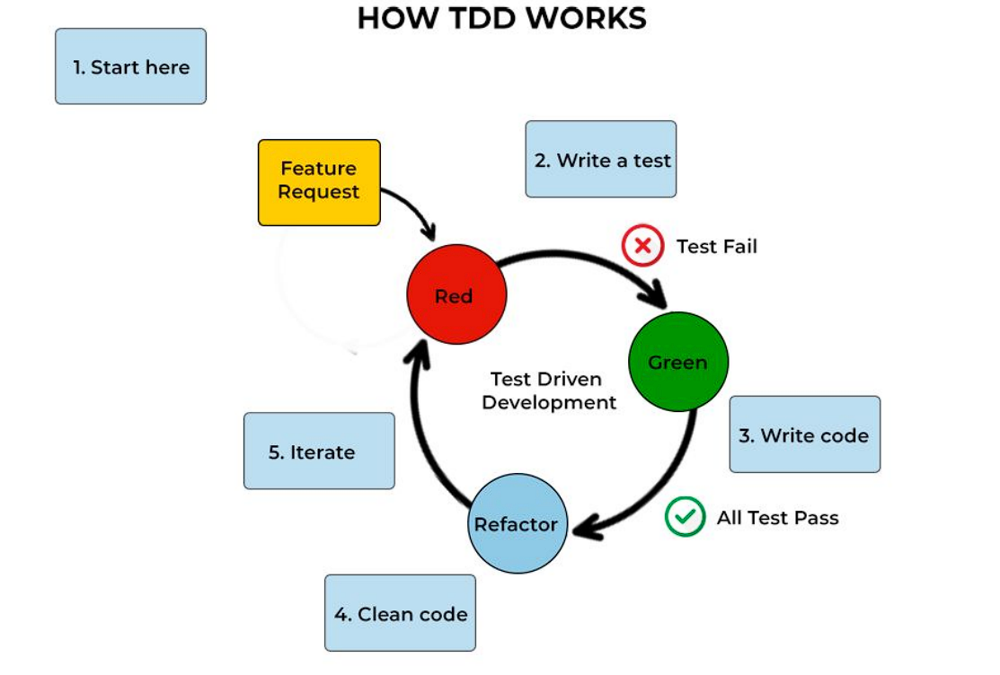
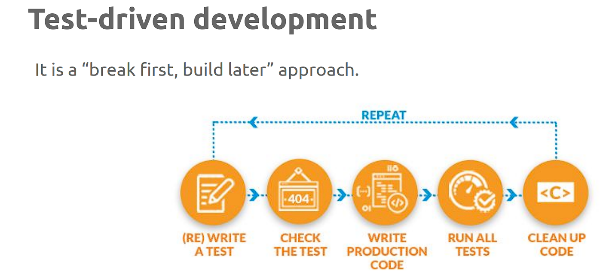

## Release testing
это этап проверки программного обеспечения перед его окончательным выпуском в продуктивную среду. Этот тип тестирования направлен на выявление дефектов и оценку готовности программного продукта к эксплуатации. Release Testing охватывает все аспекты программного обеспечения, чтобы гарантировать его соответствие требованиям и ожиданиям пользователей.

- **Requirements-based testing**, Убедиться, что продукт соответствует всем функциональным и нефункциональным требованиям, установленным на предыдущих этапах разработки.

- **Scenario testing**, это подход к тестированию релизов, при котором вы
разрабатываете типичные сценарии использования и используете их для разработки
тестовых примеров для системы
- **Performance testing**, включает в себя выполнение серии тестов, в ходе которых вы увеличиваете
нагрузку до тех пор, пока производительность системы не станет неприемлемой

### User testing
 это метод проверки программного обеспечения или продукта, при котором реальные пользователи взаимодействуют с продуктом для выявления проблем, оценки удобства использования и сбора обратной связи. Цель пользовательского тестирования — понять, как пользователи воспринимают продукт, насколько удобно и эффективно они могут его использовать, и выявить области, требующие улучшения.